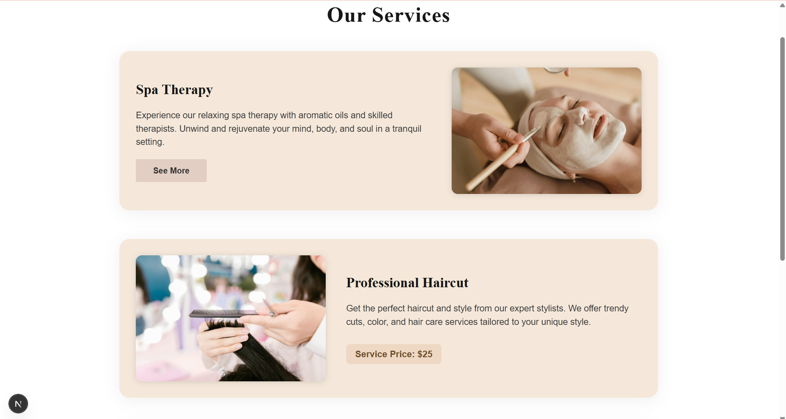
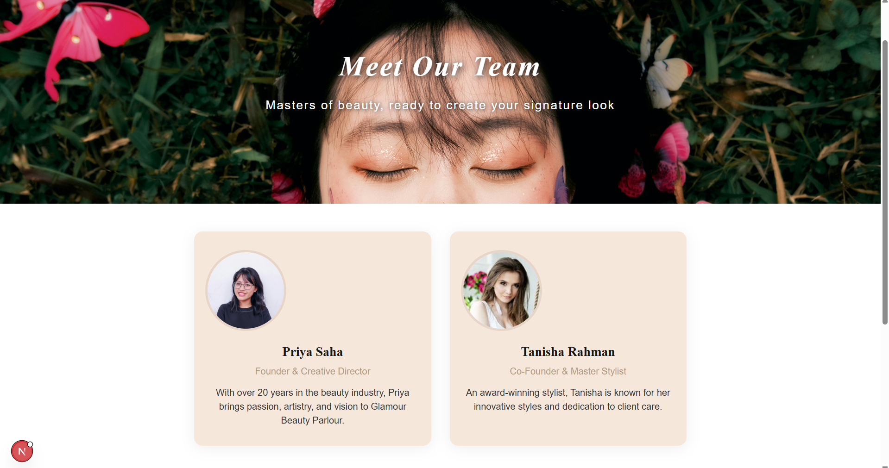
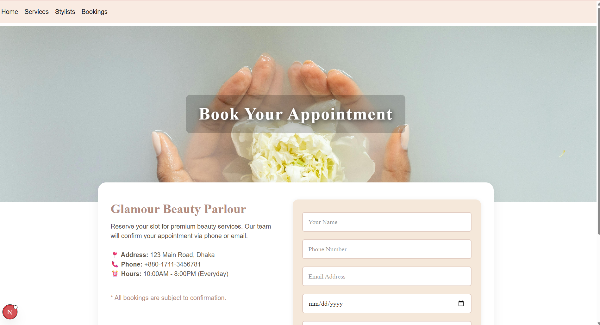
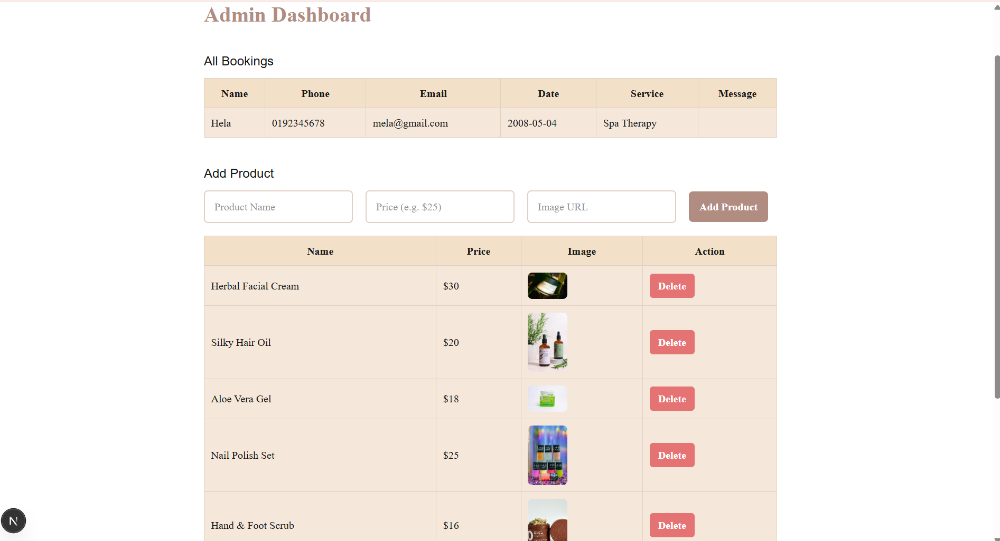

# Beauty Parlour Store – Fullstack Web App

A modern beauty parlour/spa store web app built with **Next.js 14, React, and Tailwind CSS**  
Includes: Home, Services, Stylists, Bookings, Products, and an Admin dashboard with full CRUD for bookings & products.

## ✨ Features

- Beautiful landing page (parallax effects, carousel, elegant UI)
- Services page with price reveal
- Dynamic product grid (admin can add/delete products)
- Bookings with CRUD via admin
- Stylists profile page
- Admin dashboard (manage bookings & products, live updates)
- Modern responsive design

## 📸 Screenshots

### Home Page

./screenshots/Screenshot 2025-07-16 172021.png

### Services Page

./screenshots/Screenshot 2025-07-16 172644.png

### Products Section

./screenshots/Screenshot 2025-07-16 172726.png

### Bookings Page


### Admin Dashboard


## 🚀 Getting Started

### 1. Clone the repository

```bash
git clone https://github.com/YOUR_USERNAME/beauty-parlour-app.git
cd beauty-parlour-app
